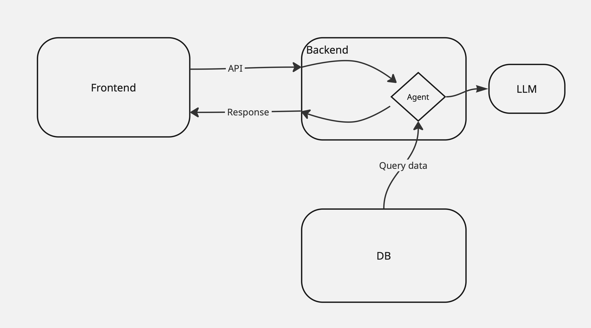

# hackathon_ai_agent
Proj for AaltoAI hackathon


## Architecture



We have 3 main components:

1. **Database**: The database is responsible for storing the data. It is built with PostgreSQL. We use the Northwind database for this project.
2. **Backend**: The backend is responsible for handling the AI agent logic and interacting with the database and LLM. It is built with FastAPI and LangGraph.
3. **Frontend**: The frontend is responsible for the user interface and uses REST API to interact with the backend. It is built using Dash.

This architecture allows us to have a flexible and scalable system, where the backend can be easily extended to serve more users and more data sources can be plugged in if needed.

Rest API is used to integrate the frontend with the backend, providing a standardized way for communication while frontend can focus more on the UI/UX side to provide a better user experience.


## Run the project

### Secert management

Put your own secrets in the .env file:
```
AZURE_OPENAI_ENDPOINT=[YOUR_AZURE_OPENAI_ENDPOINT]
AZURE_OPENAI_API_KEY=[YOUR_AZURE_OPENAI_API_KEY]
AZURE_OPENAI_API_VERSION=[YOUR_AZURE_OPENAI_API_VERSION]
AZURE_OPENAI_DEPLOYMENT=[YOUR_AZURE_OPENAI_DEPLOYMENT]
PYTHONPATH=./src
LANGSMITH_TRACING=true # if you wish to use langsmith for tracing
LANGSMITH_PROJECT=[YOUR_LANGSMITH_PROJECT]
LANGSMITH_API_KEY=[YOUR_LANGSMITH_API_KEY]
```

### Local development

Here we use *uv* to have a smooth experience to handle the Python environment and dependencies for us. It is a wrapper around *poetry* and *pyenv*.

Follow [this introduction](https://docs.astral.sh/uv/getting-started/installation) to install Poetry and you can also enable the tab completion for it for the terminal you use.

After that, move to the root directory of this repo and install a local Python environment:
```shell
uv sync
```

After this, a Python virtual environment with dependencies will be created. And you can easily run python scripts in the project using `uv run python <script_name>`.

### Docker support

The Backend and Database can be run in Docker containers, to spin them up, run:
```
docker compose up
```

To stop them, run:
```
docker compose down
```

Backend will be available at `http://localhost:8002` and you can check out it API spec at `http://localhost:8002/docs`.

### LangSmith Tracing

LangSmith Tracing can also be used for tracing the AI agent's behavior. After simply adding your key, you can find the traces at `https://smith.langchain.com/` and you can also use the `langsmith` CLI to view the traces.

### Frontend
