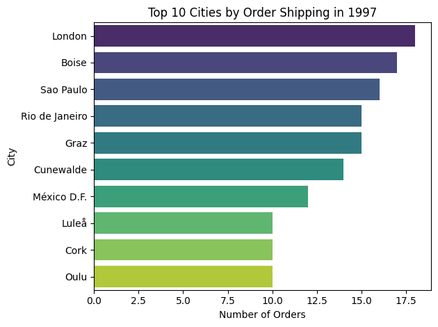

# Data Analyst Agent for Northwind Database

A data analyst agent that can help you dig into the database and provide insights and visualizations by self-driving and self-checking.

This project is built for AaltoAI hackathon 2025.

[Video demo](https://youtu.be/YHUd5IUiUT8)

## Architecture


We have 3 main components:

1. **Database**: The database is responsible for storing the data. It is built with PostgreSQL. We use the Northwind database for this project.
2. **Backend**: The backend is responsible for handling the AI agent logic and interacting with the database and LLM(here we use gpt-4.1). It is built with FastAPI and LangGraph.
3. **Frontend**: The frontend is responsible for the user interface and uses REST API to interact with the backend. It is built using Dash.

This architecture allows us to have a flexible and scalable system, where the backend can be easily extended to serve more users and more data sources can be plugged in if needed.

Rest API is used to integrate the frontend with the backend, providing a standardized way for communication while frontend can focus more on the UI/UX side to provide a better user experience.

## Agent Graph


Our agent is equipped with a set of tools to interact with the database and LLM:

- **sql_db_schema**: Given a comma-separated list of table names, returns the schema and sample rows for those tables. Use after confirming table existence with `sql_db_list_tables`.
- **sql_db_list_tables**: Returns a comma-separated list of all tables in the database. Use to discover available tables.
- **sql_db_query_checker**: Checks if a given SQL query is valid (using EXPLAIN). Always use before executing a query with `sql_db_query`.
- **sql_db_query**: Executes a detailed and correct SQL query, returns results and reasoning, and supports specifying a visualization type (bar, line, pie, scatter). Main tool for querying the database and getting results for analysis and visualization.
- **create_visualization_with_python_code**: Executes user-supplied Python code (using pandas/seaborn) to create a visualization from a DataFrame, returns a base64-encoded PNG image. Used to generate custom visualizations from query results.
- **python_code_checker**: Checks if a given Python code string is syntactically valid and safe (no dangerous operations). Always use before executing any user-generated Python code.

## Run the project

### Secert management

Put your own secrets in the .env file:
```
AZURE_OPENAI_ENDPOINT=[YOUR_AZURE_OPENAI_ENDPOINT]
AZURE_OPENAI_API_KEY=[YOUR_AZURE_OPENAI_API_KEY]
AZURE_OPENAI_API_VERSION=[YOUR_AZURE_OPENAI_API_VERSION]
AZURE_OPENAI_DEPLOYMENT=[YOUR_AZURE_OPENAI_DEPLOYMENT]
PYTHONPATH=./src
LANGSMITH_TRACING=true # if you wish to use langsmith for tracing
LANGSMITH_PROJECT=[YOUR_LANGSMITH_PROJECT]
LANGSMITH_API_KEY=[YOUR_LANGSMITH_API_KEY]
```

### Local development

Here we use *uv* to have a smooth experience to handle the Python environment and dependencies for us. It is a wrapper around *poetry* and *pyenv*.

Follow [this introduction](https://docs.astral.sh/uv/getting-started/installation) to install Poetry and you can also enable the tab completion for it for the terminal you use.

After that, move to the root directory of this repo and install a local Python environment:
```shell
uv sync
```

After this, a Python virtual environment with dependencies will be created. And you can easily run python scripts in the project using `uv run python <script_name>`.

### Docker support

The Backend and Database can be run in Docker containers, to spin them up, run:
```
docker compose up
```

To stop them, run:
```
docker compose down
```

Backend will be available at `http://localhost:8002` and you can check out it API spec at `http://localhost:8002/docs`.

### Frontend

Frontend provides a way to write questions regarding the Northwind dataset and see the answers as text and images.


To spin up the front end, run `uv run python src/frontend/app.py` in the project root.

### LangSmith Tracing

LangSmith Tracing can also be used for tracing the AI agent's behavior. After simply adding your key, you can find the traces at `https://smith.langchain.com/` and you can also use the `langsmith` CLI to view the traces.

## Example questions & answers

Q: In 1997, what are the top 10 cities by order shipping?

A:

**Result:**
Here are the top 10 cities by order shipping in 1997, along with a bar chart visualization:

1. London (18 orders)
2. Boise (17 orders)
3. Sao Paulo (16 orders)
4. Rio de Janeiro (15 orders)
5. Graz (15 orders)
6. Cunewalde (14 orders)
7. México D.F. (12 orders)
8. Luleå (10 orders)
9. Cork (10 orders)
10. Oulu (10 orders)

The bar chart below shows the number of orders shipped to each city:

[Visualization shown above]

If you need further details or a complete ranking, let me know!

**Visualization:**


**Follow-up question:**
1. Would you like to see the list for other years or compare 1997 with another year?
2. Are you interested in the top products or categories shipped to these cities in 1997?
3. Would you like more details about the customers or revenue from these top cities?

Q: Which employee has the most orders? and show me the top 5 products that he/she sold?

A:

**Result:**

The employee with the most orders is **Margaret Peacock** (employee_id = 4), with 156 orders.

The top 5 products she sold (by total quantity) are:

1. **Pâté chinois** - 414 units
2. **Camembert Pierrot** - 331 units
3. **Sir Rodney's Scones** - 313 units
4. **Boston Crab Meat** - 298 units
5. **Chang** - 294 units

Here is a bar chart showing the quantities for her top 5 products:

**Visualization:**


**Follow-up question:**

1. Would you like to see sales trends over time for Margaret Peacock or her top products?
2. Are you interested in viewing similar statistics for other employees or comparing their performance?
3. Do you want a detailed breakdown of sales (such as revenue or customer segments) for these top products?

Q:

A:  
**Result:**
Here is a summary of year-over-year sales by product category for the latest years in the database (1998 vs 1997):

**Top 5 categories with their sales in 1997 and 1998, absolute change, and percentage change**:

| Category        | 1997 Sales | 1998 Sales | Absolute Change | % Change     |
|:----------------|-----------:|-----------:|---------------:|-------------:|
| Beverages       | 103,924    | 116,025    | +12,101        | +11.6%       |
| Condiments      | 55,369     | 32,778     | -22,591        | -40.8%       |
| Confections     | 82,658     | 55,014     | -27,644        | -33.4%       |
| Dairy Products  | 115,388    | 78,139     | -37,249        | -32.3%       |
| Grains/Cereals  | 56,872     | 29,365     | -27,506        | -48.4%       |

- Only the **Beverages** category saw an increase in sales (+11.6%).
- All other categories experienced significant declines (most by 30-50%).

The bar chart above visualizes the absolute year-over-year change for each category, providing a clear comparison.

If you need the whole table or a visualization of the percentage changes specifically, please let me know!

**Visualization:**


**Follow-up question:**

1. Would you like to see the full list of all product categories or just the top performers and biggest declines?
2. Are you interested in understanding the reasons behind the sales changes for any specific categories?
3. Would you like to see this analysis broken down by region or individual products within each category?
