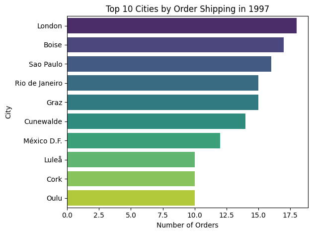
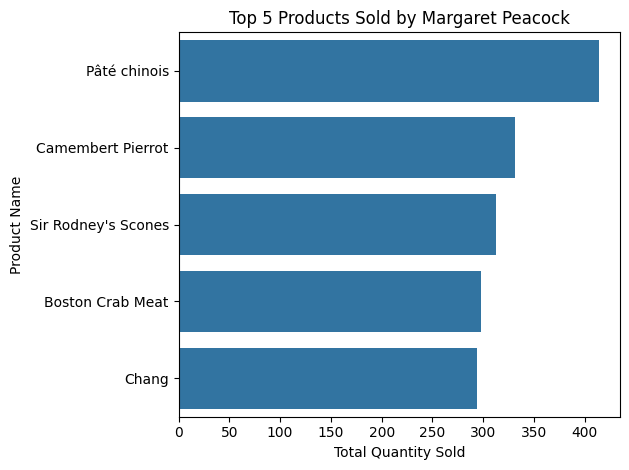
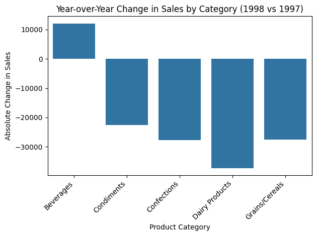

# Example questions

Q: In 1997, what are the top 10 cities by order shipping?

A:

**Result:**
Here are the top 10 cities by order shipping in 1997, along with a bar chart visualization:

1. London (18 orders)
2. Boise (17 orders)
3. Sao Paulo (16 orders)
4. Rio de Janeiro (15 orders)
5. Graz (15 orders)
6. Cunewalde (14 orders)
7. México D.F. (12 orders)
8. Luleå (10 orders)
9. Cork (10 orders)
10. Oulu (10 orders)

The bar chart below shows the number of orders shipped to each city:

[Visualization shown above]

If you need further details or a complete ranking, let me know!

**Visualization:**

**Follow-up question:**
1. Would you like to see the list for other years or compare 1997 with another year?
2. Are you interested in the top products or categories shipped to these cities in 1997?
3. Would you like more details about the customers or revenue from these top cities?

Q: Which employee has the most orders? and show me the top 5 products that he/she sold?

A:

**Result:**

The employee with the most orders is **Margaret Peacock** (employee_id = 4), with 156 orders.

The top 5 products she sold (by total quantity) are:

1. **Pâté chinois** - 414 units
2. **Camembert Pierrot** - 331 units
3. **Sir Rodney's Scones** - 313 units
4. **Boston Crab Meat** - 298 units
5. **Chang** - 294 units

Here is a bar chart showing the quantities for her top 5 products:

**Visualization:**

**Follow-up question:**

1. Would you like to see sales trends over time for Margaret Peacock or her top products?
2. Are you interested in viewing similar statistics for other employees or comparing their performance?
3. Do you want a detailed breakdown of sales (such as revenue or customer segments) for these top products?

Q:

A:  
**Result:**
Here is a summary of year-over-year sales by product category for the latest years in the database (1998 vs 1997):

**Top 5 categories with their sales in 1997 and 1998, absolute change, and percentage change**:

| Category        | 1997 Sales | 1998 Sales | Absolute Change | % Change     |
|:----------------|-----------:|-----------:|---------------:|-------------:|
| Beverages       | 103,924    | 116,025    | +12,101        | +11.6%       |
| Condiments      | 55,369     | 32,778     | -22,591        | -40.8%       |
| Confections     | 82,658     | 55,014     | -27,644        | -33.4%       |
| Dairy Products  | 115,388    | 78,139     | -37,249        | -32.3%       |
| Grains/Cereals  | 56,872     | 29,365     | -27,506        | -48.4%       |

- Only the **Beverages** category saw an increase in sales (+11.6%).
- All other categories experienced significant declines (most by 30-50%).

The bar chart above visualizes the absolute year-over-year change for each category, providing a clear comparison.

If you need the whole table or a visualization of the percentage changes specifically, please let me know!

**Visualization:**

**Follow-up question:**

1. Would you like to see the full list of all product categories or just the top performers and biggest declines?
2. Are you interested in understanding the reasons behind the sales changes for any specific categories?
3. Would you like to see this analysis broken down by region or individual products within each category?
